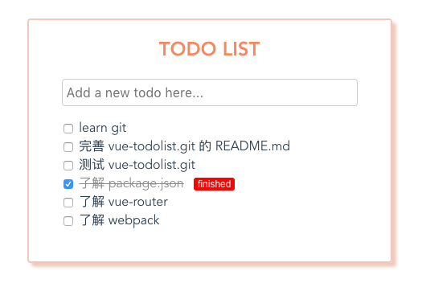

# vue-project

> 这是本人仿照[慕课网视频](https://www.imooc.com/learn/694) 做的一个简单的 todolist-demo。

## 1.下载安装

``` bash
# install dependencies
npm install

# serve with hot reload at localhost:8080
npm run dev

# build for production with minification
npm run build
```
## 2.参考图片


